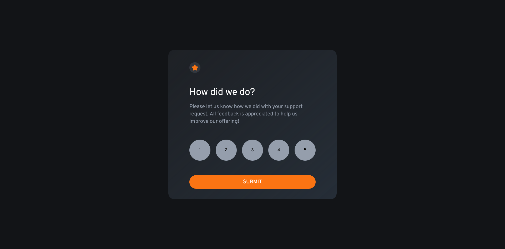
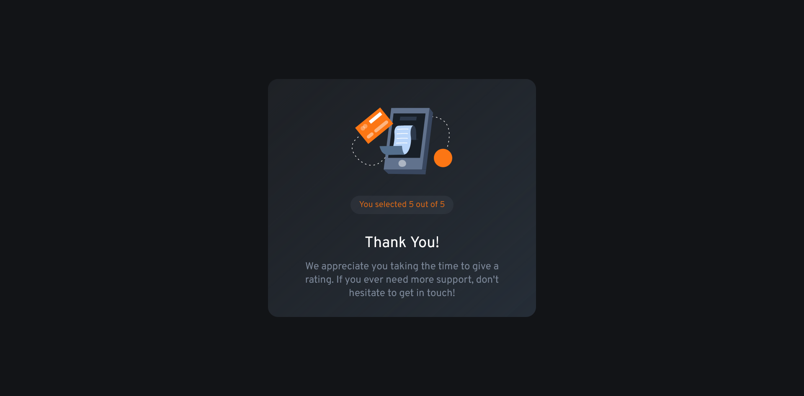

# Frontend Mentor - Interactive rating component solution

This is a solution to the [Interactive rating component challenge on Frontend Mentor](https://www.frontendmentor.io/challenges/interactive-rating-component-koxpeBUmI). Frontend Mentor challenges help you improve your coding skills by building realistic projects. 

## Table of contents

- [Overview](#overview)
  - [The challenge](#the-challenge)
  - [Screenshot](#screenshot)
  - [Links](#links)
- [My process](#my-process)
  - [Built with](#built-with)
  - [What I learned](#what-i-learned)
  - [Continued development](#continued-development)
  - [Useful resources](#useful-resources)
- [Author](#author)
- [Acknowledgments](#acknowledgments)

## Overview

### The challenge

Users should be able to:

- View the optimal layout for the app depending on their device's screen size
- See hover states for all interactive elements on the page
- Select and submit a number rating
- See the "Thank you" card state after submitting a rating

### Screenshot

### Links

- Solution URL: [Add solution URL here](https://your-solution-url.com)
- Live Site URL: [Add live site URL here](https://your-live-site-url.com)

## My process

### Built with

- Semantic HTML5 markup
- CSS custom properties
- Flexbox
- [React](https://reactjs.org/) - JS library
- [Next.js](https://nextjs.org/) - React framework
- [Tailwind](https://https://tailwindcss.com//) - For styles

### What I learned

The project did not require any thing that I did not know already although I am bit conscious on 
my usage of ternary operator to display to the different views. I'm not sure if that's what is done
on the industry or if there's a better and cleaner code.

### Continued development

The project looks great on the specified screen sizes but fall short on any screen size in between.
Also, I think it would be great if the Thank you message would be different depending on the rating
given by the user. For example if a user gives a rating below 3 then obviously the user did not had
a great time using the service, so a link perhaps that would redirect the user to submit a complain
or suggestion.

### Useful resources

- [resource 2](https://livebook.manning.com/book/next-js-in-action/welcome/v-2/) 
    - Great book for React introduction

## Author

- Github - [awesooomeME](https://github.com/awesooomeME)
- Frontend Mentor - [@awesooomeME](https://www.frontendmentor.io/profile/awesooomeME)
